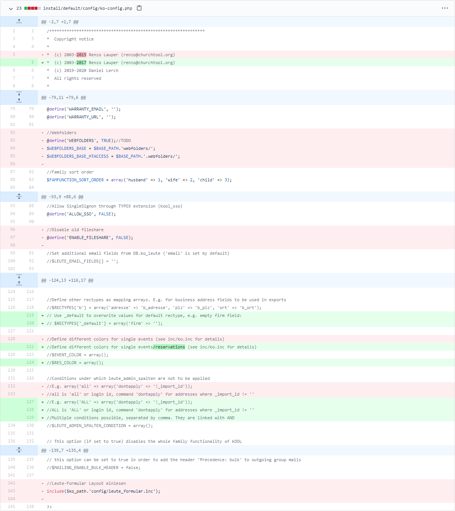

# OpenKool R47 upgrade instructions

## Prerequisites
- Dockerized OpenKool R46 installation
- Backup of config files (might get overridden)
- MySQL database backup (no downgrade path)

## Steps
1. Change the image name in your compose file  
`daniellerch/openkool:r46` > `daniellerch/openkool:r47`  
and remove the `.webfolders` and `webfolders` volumes
2. Pull image and restart  
`docker-compose up -d`
3. Run the setup script  
A) `docker-compose exec app bash /var/www/html/install/setup.sh`  
You reject overriding ko-config.php and other modified config files. After that you have to edit the file manually and merge the change (see screenshot).  
`docker-compose exec app vi /var/www/html/config/ko-config.php`  
  
B) `docker-compose exec app bash /var/www/html/install/setup.sh --force`  
The script will override your config files and you have to run the web installer again (see [install.md](install.md)).
4. Call install/update.phpsh from your web root with parameter -p to show changes and with -a to update the database.  
`docker-compose exec app bash`  
`./install/update.phpsh -a`
5. Stay in your container and run the update script
`php kool_update_r46_r47.php`
6. Your upgrade is finished. You may enable the two new modules `subscription` and `taxonomy` in `ko-config.php` now.
